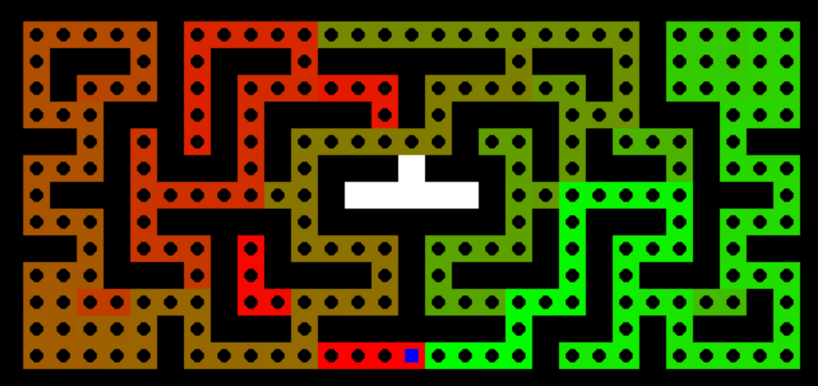

# MP1 Report

- **Team Members:** Zhirong Chen (zhirong4), Xiaoyang Chu (), Jiajun Hu (jiajunh5),  Yanbing Yang (yanbing7)
- **Date:** 3/17/2024

---

## Section I: Algorithms (Search)

In this section, we describe the algorithms and data structures used for implementing four search strategies: Depth-First Search (DFS), Breadth-First Search (BFS), Greedy Best-First Search (Greedy BFS), and A* Search.

### State and Node Representation

- **State:** In the context of your maze problem, a state represents the current condition or position within the maze. Specifically, it refers to a coordinate (x, y) indicating the location of the searcher (or agent) within the maze.  In both BFS and DFS implementations, a state is represented by the curNode or elements in the queue (for BFS) and stack (for DFS), which hold the current position in the maze.
- **Node:** In search algorithms, a node often refers to an element of the search tree that includes not just the state but also additional information such as the path taken to reach that state, the cost of the path, and potentially other metadata.
- **Difference:**  In BFS and DFS, the terms "node" and "state" are used interchangeably to refer to the position in the maze without additional metadata. Therefore, in this specific context, a node is essentially the same as a state.

### Frontier Management

The frontier is the set of all leaf nodes available for expansion at any given point in the search process. It's the "boundary" between the explored and unexplored areas of the search space.
- In BFS, the frontier is represented by the queue, which holds all the nodes that have been discovered but not yet explored.
- In DFS, the frontier is managed through the stack, containing nodes that have been discovered but whose neighbors haven't all been explored yet.

### Explored States List

An explored states list is a collection that keeps track of all the nodes (or states) that have been visited and explored, to prevent revisiting and re-exploring the same nodes, which ensures the efficiency of the search.
- In BFS, the parents dictionary serves a dual purpose: it maps each node to its parent (thereby implicitly tracking the path taken), and it also acts as a record of all nodes that have been visited (or explored), as nodes are added to parents once they are popped from the queue and processed.
- In DFS, explored nodes are implicitly tracked through the stack and the unreachable set. The unreachable set specifically helps to avoid revisiting nodes that have been determined to lead to dead ends or have already been explored.

### Repeated States Detection and Management
- BFS: Repeated states are managed through the parents dictionary. Before a node is added to the queue (i.e., the frontier), it is checked against the keys of the parents dictionary to ensure it hasn't been visited before.
- DFS: Repeated states are avoided by checking if a neighbor is already in the stack (which would indicate a loop) or if it is in the unreachable set (meaning it has been previously explored and found to lead to a dead end or has already been visited).

---

## Section II: Algorithms (A* and Greedy BFS)

This section focuses on the heuristic(s) used for A* and Greedy BFS, particularly for single-dot and multiple-dot scenarios.

### Heuristic(s) Used

#### Greedy Best-First Search (Greedy BFS)

- **Heuristic:** The heuristic function used for Greedy BFS calculates the Manhattan distance from the current node to the target node (the last objective). It is defined as `abs(target[0]-point.cord[0]) + abs(target[1]-point.cord[1])`, where `target` represents the coordinates of the target node, and `point.cord` represents the coordinates of the current node.
- **Single Dot Scenario:** In cases where there is only one dot (objective), this heuristic guides the search directly towards the goal, focusing solely on the distance to the goal without considering the cost of the path taken to reach that point.

#### A* Search

- **Heuristic:** The A* heuristic function combines the cost to reach the current node (`point.dist`, representing the distance from the start node to the current node) with the Manhattan distance to the target node. It is defined as `abs(target[0]-point.cord[0]) + abs(target[1]-point.cord[1]) + point.dist`.
- **Single Dot Scenario:** The heuristic effectively estimates the total cost of the cheapest solution through the current node, balancing the cost of reaching the current node and the estimated cost to reach the goal. The heuristic is admissible as it is the shortest possible path in the maze that connecting the destination and the origin.
- **Multiple-Dot Situation:** Minimum Spanning Tree(MST) is used to generate a heuristic estimation for the a search node. The tree uses the L1 distance as the weight of the edge. The heuristic function is admissible, which is proved as follows.
  > **Proof:**
  > Given current coordinate $p$ and a set $U$ containing $S(U)$ destinations that has not yet been explored. Define $L(a,b)$ as the Manhattan distance between point $a$ and pont $b$. Define $I(a,b)$ as the shortest distance in the maze connnecting point $a$ and $b$. We have $L(a,b) \leq I(a,b)$.
  > Define a fully connnected undirected graph $G$ with verticle set $V=\{p\}\cup U$ and edge set $E$. Each pair of vertices $(v_i,v_j)$ are connected by a edge $e_k$ with weight $W(e_k) = I(v_i,v_j)$. Let $T$ to be a MST over the graph $G$.
  > Define the summed weight of a graph $$W(G)=\sum_{e_i\in E}{W(e_i)}$$ Define $\Omega$ as the set of all the connected subgraph over the graph $G$.
  > According to the definition of MST, we have $$\forall k \in \Omega,  W(T)\leq W(k)$$ 
  > Define $s$ to be the shortest path in the maze connecting every vertice. By definition $s \in \Omega$
  >Hence, we have $W(T) \leq W(s)$.
  >In our heuristic function, we use the L1 distance instead of the actual shortest path between two nodes in the maze. As we argued above, $\forall v_i\in V$ and $\forall v_j \in V$, $L(v_i,v_j)\leq I(v_1,v_2)$. We define $G'$ to be another fully connected undirected graph with vertices set $V' = V$ and $E'$, $W(e_k)=L(v_i,v_j)$ and a minimum spanning tree $T'$ over graph $G'$. Let $T''$ to be the subgraph that is the same as $T$ except that $W(T'')$ is assigned by the function $L(a,b)$. We define the heuristc function as follows $$h(p)= W(T')$$ and $$h(p) = W(T') \leq W(T'')\leq W(T) \leq s$$
  > Hence $h(p)$ is admissible

### Admissibility of the A* Heuristic

A heuristic is admissible if it never overestimates the cost to reach the goal from any node in the search space. To prove the admissibility of the A* heuristic:

1. **Manhattan Distance:** The use of Manhattan distance as part of the heuristic ensures admissibility in a grid maze where only horizontal and vertical movements are allowed, as it exactly matches the minimum possible cost to reach the target from the current node (assuming a cost of 1 per step and no obstacles directly between the current node and the target).

2. **Path Cost Addition:** Adding the actual cost (`point.dist`) from the start node to the current node does not affect the admissibility because it is a concrete cost already incurred, not an estimate.

3. **Total Heuristic:** The total A* heuristic (`abs(target[0]-point.cord[0]) + abs(target[1]-point.cord[1]) + point.dist`) is the sum of the exact cost incurred to reach the current node and the admissible estimate of the remaining cost to the target. Since neither component overestimates the true cost, the overall heuristic is admissible.

In conclusion, the A* heuristic used in your implementation is admissible for the single dot scenario. For multiple-dot scenarios, while the heuristic remains admissible for reaching the final dot, the strategy does not inherently ensure an optimal path covering all dots, as it does not account for the necessity to visit each objective. 

---

## Section III: Results (Basic Pathfinding)

Present the results for each algorithm across different mazes. Include screenshots of the mazes with computed paths, solution costs, and the number of expanded nodes.

### DFS Results
- **Solution Cost and number of Expanded Nodes of DFS search trials:**

  
  |Maze|mediumMaze|bigMaze|openMaze|
  |:-:|:-:|:-:|:-:|
  |Solution Cost|131|211|299|
  |Number of Expanded Nodes|147|427|650|

- **Solution Graphs of DFS search trials:**

DFS search in mediumMaze 
  
DFS search in bigMaze 
  
DFS search in openMaze 
  

  
### BFS Results
- **Solution Cost and number of Expanded Nodes of BFS search trials:**

  
  |Maze|mediumMaze|bigMaze|openMaze|
  |:-:|:-:|:-:|:-:|
  |Solution Cost|69|211|55|
  |Number of Expanded Nodes|270|620|683|

- **Solution Graphs of BFS search trials:**

BFS search in mediumMaze 
  
BFS search in bigMaze 
  
BFS search in openMaze 
  

### Greedy Results
- **Solution Cost and number of Expanded Nodes of greedy search trials:**

  
  |Maze|mediumMaze|bigMaze|openMaze|
  |:----:|:----:|:----:|:----:|
  |Solution Cost|153|211|55|
  |Number of Expanded Nodes|158|457|212|

- **Solution Graphs of greedy search trials:**

Greedy search in mediumMaze 
   
Greedy search in bigMaze 
  
Greedy search in openMaze 
  

### A* Results

- **Solution Cost and number of Expanded Nodes of A* search trials:**

  
  |Maze|mediumMaze|bigMaze|openMaze|
  |:----:|:----:|:----:|:----:|
  |Solution Cost|69|211|55|
  |Number of Expanded Nodes|211|579|226|

- **Solution Graphs of A\* search trials:**

A* search in mediumMaze 
   
A* search in bigMaze 
  
A* search in openMaze 
  

---

## Section IV: Results (Search with Multiple Dots)

Discuss the outcomes of employing your A* algorithm on mazes with multiple dots. Include screenshots, solution costs, and the number of expanded nodes.

### Tiny Maze

  
- Solution Cost: 28
- Expanded Nodes: 580

### Small Maze

  
- Solution Cost: 35
- Expanded Nodes: 438

### Medium Maze

  
- Solution Cost: 169
- Expanded Nodes: 212243

---
## Extra Credit： 
If you have done any work which you think should get extra credit, describe it here

- To search for sub-optimal path, we considered A* algorithm using a non-admissible heuristic function. We use manhatten distance as our h(n), and we choose the objectives with minimum h(n) as our next target. Than we use the standard A* search method to find out the shortest path to this target and repeat the previous process till we go through all objectives. Compare with original A*, this non-admissable A* has a faster search speed. 
  
- The following are the picture and table for our algorithm result.
  
### BigDots Table & Picture

  
  |BigDots  | none-admissable A*  |
  |:----:|:----:|
  |Path Length|326|
  |States Explored|612|

  

---

## Statement of Contribution
- Zhirong Chen: Write the report
- Jiajun Hu: BFS, DFS
- Xiaoyang Chu: A*, Greedy, A* MultiDot
- Yanbing Yang: Greedy, Code Review

---

