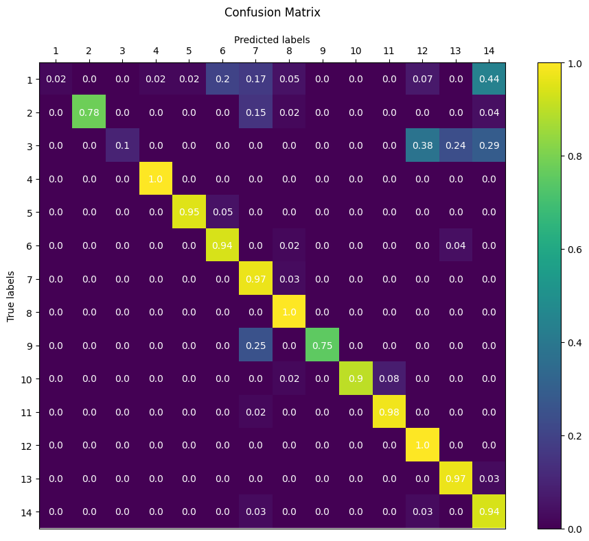
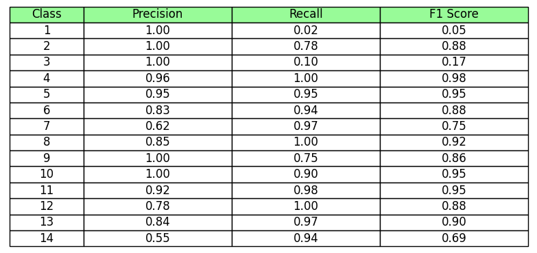
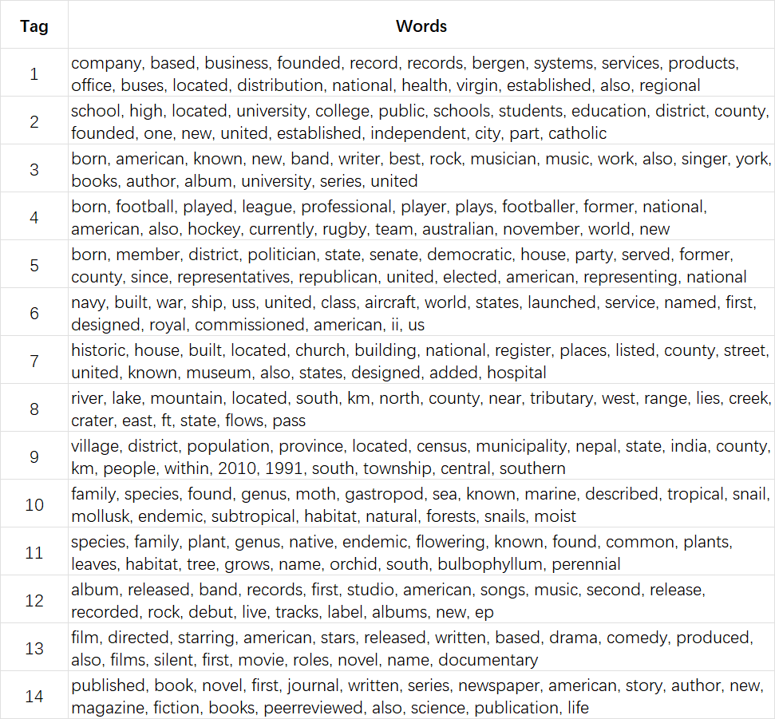
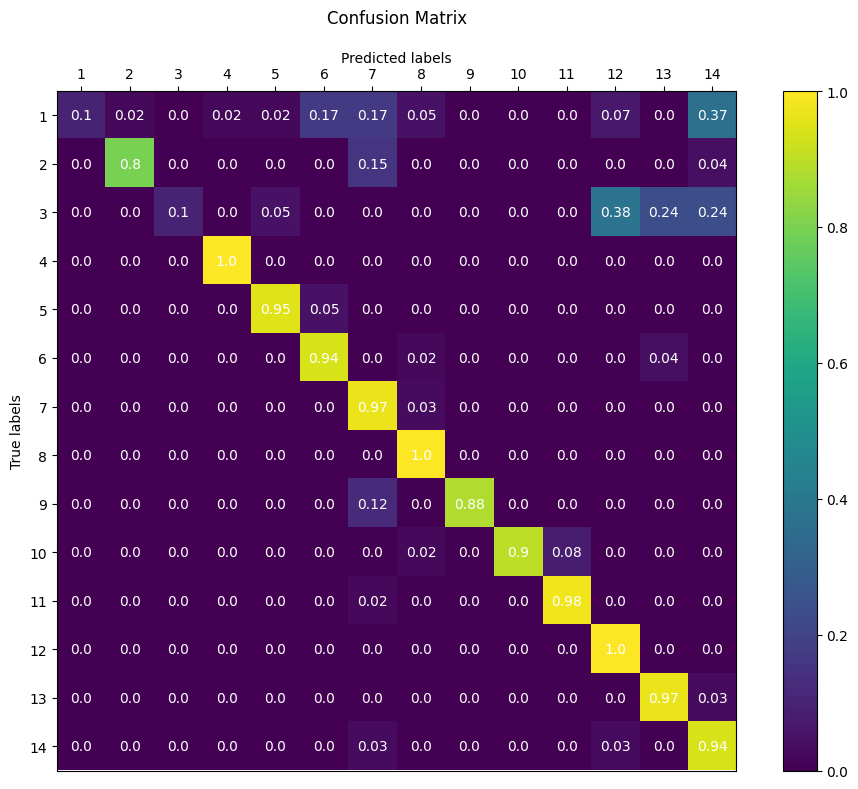
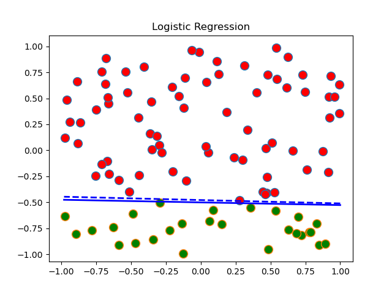

# MP3 Report

- **Team Members:** Zhirong Chen (zhirong4), Xiaoyang Chu (xzhu58), Jiajun Hu (jiajunh5),  Yanbing Yang (yanbing7)
- **Date:** 4/26/2024

---

## Section I: Image Classification

In this section, we will report the results of Naive Bayse mode over MNIST image data set.

We've tried a range of $k$ to maximize the average classification rate. It appears that the average classification rate will drop when $k$ is either too large (~10) or too small (~0.01) . The following data was obtained when $k = 0.1$. 

- Average Classification Rate is 0.8447
- Class Statistics

<table style="width:100%">
  <tr>
    <th>Class</th>
    <th>Classification Rate</th>
    <th>Highest Posterior</th>
    <th>Lowest Posterior</th>
  </tr>
  <tr>
    <td>0</td>
    <td>0.8990</td>
    <td></td>
    <td></td>
  </tr>
  <tr>
    <td>1</td>
    <td>0.9471</td>
    <td></td>
    <td></td>
  </tr>  <tr>
    <td>2</td>
    <td>0.8207</td>
    <td></td>
    <td></td>
  </tr>  <tr>
    <td>3</td>
    <td>0.0.8376</td>
    <td></td>
    <td></td>
  </tr>  <tr>
    <td>4</td>
    <td>0.0.8320</td>
    <td></td>
    <td></td>
  </tr>  <tr>
    <td>5</td>
    <td>0.7197</td>
    <td></td>
    <td></td>
  </tr>  <tr>
    <td>6</td>
    <td>0.8987</td>
    <td></td>
    <td></td>
  </tr>  <tr>
    <td>7</td>
    <td>0.8230</td>
    <td></td>
    <td></td>
  </tr>  <tr>
    <td>8</td>
    <td>0.8039</td>
    <td></td>
    <td></td>
  </tr>  <tr>
    <td>9</td>
    <td>0.8414</td>
    <td></td>
    <td></td>
  </tr>  
</table>
Tab. 1 Class Statistics

- Confusion Matrix

 
Fig. 1: Confusion Matrix

- Feature Likelihoods

 
Fig. 2: Feature Likelihoods

---

## Section II: Text Classification
- 2.1 Confusion Matrix

 
Fig. 1: Confusion Matrix

- 2.2 Aurracy, recall, and F1 scores

 
Fig. 2: Data table

- 2.3 Top 20 feature words in 14 classes  

 
Fig. 3: Top 20 feature words in each label

- 2.4 Confusion Matrix Excluding P(class)  
  
  By compare the new confusion matrix with the previous one, we notice the accuracy increases, which is out of our expectation especially the accuracy of label 1. Therefore, we can conclude that including class prior is not always beneficial.

  Changing the class prior to uniform distribution has the same result as excluding the class prior.  

 
Fig. 4: Confusion Matrix

---
## Section III: Linear Classfier
**Training Result**

**Logistic Model Error**

E_train is 0.009899999999999996, E_test is 0.016954

---
## Extra Credit
**Accuracy at different lambda_mix**

  |lambda_mix|<0.5|0.6~0.7|0.8|0.9|
  |:----:|:----:|:----:|:----:|:----:|
  |Accuracy|0.8116|0.8095|0.8012|0.7619|
  
**Conclusion of Bigram mixed model**

The Bigram model is incorporated into the original model with a fusion ratio of 𝜆 in this section. The Bigram model considers the interaction between words within the same inference group, specifically their conditional probability. Through experimentation, it was found that the optimal accuracy is achieved when the hyper-parameter 𝜆 equals 0.6. However, this may not always be advantageous due to limited training data resulting in numerous binary word groups being absent from the model. This discrepancy is further amplified by Laplace smoothing, causing significant deviation in results when relying solely on the Bigram model.  
The actural prediction accuracy did not varies as expect as the increasing 𝜆, which is monotone with the mixing weight. The mixing of model did not make a difference until the 𝜆 is higher than 0.6. We found the detailed accuracy for each classification is slightly diffrerent while the overall stastics analysis shows no variation when adjusting 𝜆 within a narrow range.

## Statement of Contribution
- Zhirong Chen: Finish the part 3, logistic regression
- Jiajun Hu: Finish part2, Bag of words task
- Xiaoyang Chu: Image Classification
- Yanbing Yang: 

---

