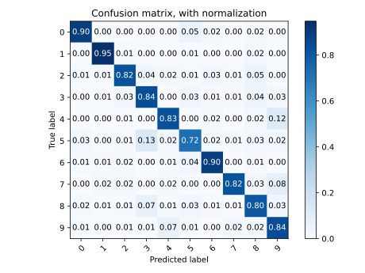
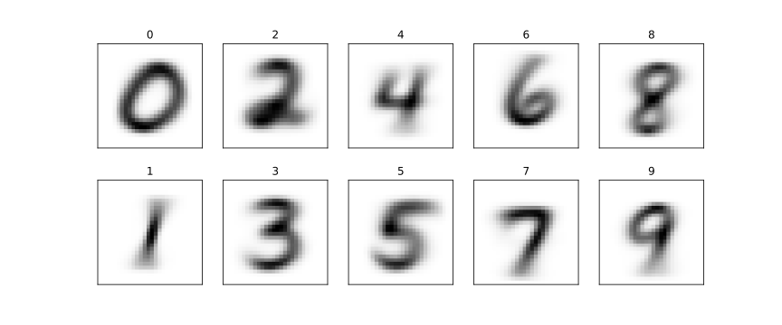

# MP3 Report

- **Team Members:** Zhirong Chen (zhirong4), Xiaoyang Chu (xzhu58), Jiajun Hu (jiajunh5),  Yanbing Yang (yanbing7)
- **Date:** 4/26/2024

---

## Section I: Image Classification

In this section, we will report the results of Naive Bayse mode over MNIST image data set.

We've tried a range of $k$ to maximize the average classification rate. It appears that the average classification rate will drop when $k$ is either too large (~10) or too small (~0.01) . The following data was obtained when $k = 0.1$. 

- Average Classification Rate is 0.8447
- Class Statistics

<table style="width:100%">
  <tr>
    <th>Class</th>
    <th>Classification Rate</th>
    <th>Highest Posterior</th>
    <th>Lowest Posterior</th>
  </tr>
  <tr>
    <td>0</td>
    <td>0.8990</td>
    <td></td>
    <td></td>
  </tr>
  <tr>
    <td>1</td>
    <td>0.9471</td>
    <td></td>
    <td></td>
  </tr>  <tr>
    <td>2</td>
    <td>0.8207</td>
    <td></td>
    <td></td>
  </tr>  <tr>
    <td>3</td>
    <td>0.0.8376</td>
    <td></td>
    <td></td>
  </tr>  <tr>
    <td>4</td>
    <td>0.0.8320</td>
    <td></td>
    <td></td>
  </tr>  <tr>
    <td>5</td>
    <td>0.7197</td>
    <td></td>
    <td></td>
  </tr>  <tr>
    <td>6</td>
    <td>0.8987</td>
    <td></td>
    <td></td>
  </tr>  <tr>
    <td>7</td>
    <td>0.8230</td>
    <td></td>
    <td></td>
  </tr>  <tr>
    <td>8</td>
    <td>0.8039</td>
    <td></td>
    <td></td>
  </tr>  <tr>
    <td>9</td>
    <td>0.8414</td>
    <td></td>
    <td></td>
  </tr>  
</table>
Tab. 1 Class Statistics

- Confusion Matrix

 
Fig. 1: Confusion Matrix

- Feature Likelihoods

 
Fig. 2: Confusion Matrix

---

## Section II: Text Classification

---
## Section III: Linear Classfier

---
## Extra Credit

---

## Statement of Contribution
- Zhirong Chen: 
- Jiajun Hu: 
- Xiaoyang Chu: Image Classification
- Yanbing Yang: 

---

