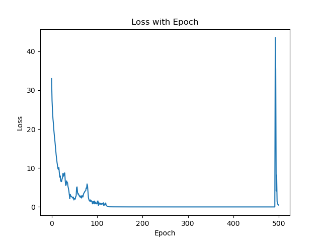

# MP5 Report

- **Team Members:** Zhirong Chen (zhirong4), Xiaoyang Chu (xzhu58), Jiajun Hu (jiajunh5),  Yanbing Yang (yanbing7)
- **Date:** 5/25/2024

---

## Part 2

Accuracy: 0.858

F1-Score: 0.880511612251767

Precision: 0.8837837837837837

Recall: 0.8772635814889336

Loss vs Epoch

**Observation**

Initial Rapid Decrease: At the beginning of training, there's a rapid decrease in loss, which is typical as the model initially makes significant improvements from its starting parameters.

Gradual Stabilization: Following the sharp initial drop, the loss gradually stabilizes and continues to decrease slowly. This is expected behavior as the model begins to converge and makes smaller adjustments to the parameters.

Sudden Spike at the End: The most notable and unusual feature of the plot is the sharp spike in loss towards the end of the training. This kind of spike is not typical and suggests some issues with the training process.

**Explanation for Spike**

Overfitting: If the training data does not generalize well or if the model is too complex relative to the amount of training data, overfitting could occur. However, overfitting typically leads to a gradual increase in loss, particularly on a validation set, rather than a sudden spike.

Learning Rate Issues: An improperly configured learning rate can cause divergence in training at later stages, especially if it's too high. However, such issues would usually cause fluctuation or gradual increase in loss much earlier than observed here.

Data Issues: If there is an issue with how data batches are prepared or if a corrupted batch of data is fed into the training process near the end, it might cause a sudden spike in loss.

Model/Training Instability: Some inherent instability in the model or the training process, possibly due to issues with numerical stability (e.g., very large or very small gradients leading to exploding or vanishing gradients), might also cause this. This could be exacerbated by specific activation functions or the lack of normalization layers in the network.

---

## Statement of Contribution
- Zhirong Chen: Finish the baseline, viterbi_1, viterbi_2
- Jiajun Hu: Also finish baseline and viterbi_1
- Xiaoyang Chu: viterbi_1
- Yanbing Yang: Extra Credit

